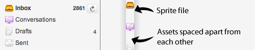

# 图标模块

CSS精灵成为现代前端开发的核心技术不是没有道理的。它可以将多个资源合并为一个资源，能够最大限度地减少HTTP请求数量，并保证一些图像被需要时（例如，翻转状态）已经完成了加载。

在CSS精灵技术被应用之前，图像主要被用于两种途径：作为背景图片，允许其他东西层叠在其之上；或者是作为前景图，与文本内联。而有了CSS精灵，所有图像都被用作背景图，并通过定位的方式显示在元素背景中。

后面的章节我们将会特别提到。

这最好以一个例子来进行解释，让我们来看一个带有图标的菜单。

带有图标的菜单


```html
<!-- 菜单的HTML -->
<ul class="menu">
    <li class="menu-inbox">Inbox</li>
    <li class="menu-drafts">Drafts</li>
</ul> 
```
上述HTML十分简单明了。我们有一个菜单项列表，而每个菜单项都被不同的类名标记，这样我们可以对每个菜单项分别写样式。

```css
/* 菜单CSS */
.menu li {
    background: url(/img/sprite.png) no-repeat 0 0;
    padding-left: 20px;
}

.menu .menu-inbox {
    background-position: 0 -20px;
}

.menu .menu-drafts {
    background-position: 0 -40px;
}
```

所有的列表项都被设置了精灵图，而对于每个不同的列表项，我们通过重新定位背景来显示正确的图标。

从表面上看，对于大部分工作来说，这看起来已经相当不错了。不过像往常一样，我们还是会遇到一些比较复杂的极端案例。

+ 我们开始依赖于特定的HTML结构：列表项
+ 精灵在其他模块需要被重新定义
+ 在元素进行定位非常脆弱：字体增大就可能大致精灵图的其他部分被暴露出来
+ 由于我们将x方向的值设为0，所以只能使用水平方向上的精灵图，这样我们处理从右向左的界面会变得更加困难

为了解决这些问题，我们将图标自身划分为一个模块：图标模块。
```html
<!-- 重构HTML来创建图标模块 -->
<li><i class="ico ico-16 ico-inbox"></i> Inbox</li> 
```
很多人可能会不敢使用`i`标签。我使用它，是因为它小，无语义的，是个没有内容的空元素。为什么当中不需要放内容呢？因为旁边已经有了可见的文本，我们不应在其中放置内容，而且如果图标被单独设置，我们可以添加一个标题属性，这样图标就可以被屏幕阅读器读取或者用作工具提示。当然如果你不认同这个观点，认为span更加合适，我也表示理解认同。

通过在单个标签中使用不同的图标类名，代码中将不会有任何其他的HTML依赖。这样很棒，但是为什么有三个不同的类名呢？这为了模仿传统的img标签——每个略有不同的类名来模拟不同的元素属性以更贴近img元素。

```css
/* 图标模块的CSS */
.ico {
    display: inline-block;
    background: url(/img/sprite.png) no-repeat;
    line-height: 0;
    vertical-align: bottom;
}

.ico-16 {
    height: 16px;
    width: 16px;
}

.ico-inbox {
    background-position: 20px 20px;
}

.ico-drafts {
    background-position: 20px 40px;
}

```

`ico`类定义了将元素转换为行内元素（图片元素是行内元素）的基本样式。你可能需要调整`vertical-align`，这样你的图标可以在文本当中正确放置。IE在将`inline-block`应用于块元素时会出问题，不过，因为我们将其应用于一个行内元素，所以这种问题并不存在。另外你也可以在IE中通过`{ zoom: 1; display: inline; }`来使得块元素表现得像行内块元素一样。

`icon-16`类定义了宽高。如果你的项目的图标只有一个尺寸的话，你可以将大小定义在`ico`类中。如果每个图标都有不同的大小，你可以为特定的图标在类中定义不同的宽高。对于这个项目，我们的图标有4种不同的尺寸。

最后一个类，`ico-inbox`，将精灵精准定位在正确的位置。有了固定的图标大小，我们就不需要关心父元素是否变得太大，而且对于从右向左的界面我们也不需要更改背景位置。

密集排布的精灵图


图片排布越密集就会有更好的压缩效果。文件越小越能提升网站的性能。（如果你还没有使用精灵图，推荐使用雅虎的[Smush.it](http://www.smushit.com/ysmush.it/)服务，或者是Mac下的[ImageOptim](http://imageoptim.pornel.net/)来保证你的图片尽可能地小）。

本章我们只是通过重构项目中特殊的一部分来使得代码变得更加灵活，其实一个问题有很多解决问题的方法，虽然这些方法看起来像表面功夫，但是不同方法却可能引出项目不同深度的问题。项目随着复杂度的变化而变化，而在这个过程中决定如何解决这个问题是做web开发乐趣的一部分。


