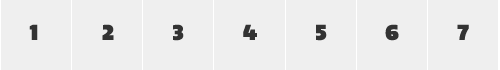

# 复杂的继承

本章我们来探讨一下继承（往往会导致原来完美的方案变得糟糕）

接下来，我们将会以一个日历作为例子，看看它的通用规则是如何和表格单元格的继承样式相冲突的，最后我们会提出良好的解决方案。

```html
<!-- 日历表格 -->
<table class="cal">
    <tr>
        <td>1</td>
        <td>2</td>
        <td>3</td>
        <td>4</td>
        <td>5</td>
        <td>6</td>
        <td>7</td>
    </tr>
    <!-- repeated 3-4 times -->
</table>
```

日历是由具有行列的表格组成的，每个单元格都是单独的一天。而该日历的默认样式就是一个日期单元格在正常情况下应该如何显示。

```css
/* 日期单元格 */
.cal td {
    background-color: #EFEFEF;
    color: #333;
}
```



表格中的每个单元格都有浅灰的背景以及深灰的字体颜色。现在，我们需要给当天的日期单元格加上高亮。

```css
/* 当天单元格的样式 */
.cal td.cal-today {
    background-color: #F33;
    color: #000;
}
```


`cal-today`这个类名表明了“当日”单元格是`cal`模块的一部分，而且它定义了特殊的样式覆盖了默认样式。我们也可以使用`td.cal-today`选择器，把它定义在默认样式之后也能起作用。而如果我们只使用`.cal-today`作为我们的选择器，那我们就不得不使用`!import`来让我们的样式起作用了。有这么多的选择，我们如何在项目发展过程中做决定就显得重要了。就比如，我在这个例子中所作出的选择，我认为，`cal-today`只能被应用于单元格（`<td>`）而且应该在`cal`元素中。

我们重新看我们的例子，现在我们需要将我们的迷你日历和更大的视图连接起来，我们的日历需要显示它被选中时的效果。

```html
<!-- 被选中行 -->
<tr class="is-selected">
    <td>1</td>
    <td class="cal-today">2</td>
    <td>3</td>
    ...
</tr>
```

```css
/* 被选中行样式 */
.is-selected {
    background-color: #FFD700; /* Yellow */
    color: #000;
}
```


上述例子你能看到问题所在吗？我们在`is-selected`对行样式的应用已经被基础“日期”样式和“当日”单元格样式所覆盖了。

这里也许我可以在状态类上添加`!important`（之前我已经提过这是可以去使用的），但是它只会在其定义的元素上添加特定样式，并不会覆盖继承，所以在上述的样式中使用`!important`并不能起作用。

所以我需要添加新的规则让选中状态能够在子元素上呈现出相应的效果。

```css
/* 表格选中行的单元格样式 */
.is-selected td {
    background-color: #FFD700; /* Yellow */
    color: #000;
}
```


如果上述选择器在`.cal`之后定义，那么所有东西就会呈现我们想要的效果。我们的“当日”日期单元格也会被渲染为红色。

## 哪里`!important`会出问题

`!important`在我们的例子中是会出问题的。现在我们将其添加到选择器中，很显然，单元格就不会显示当日效果了，渲染效果会和其他日期一样。

```css
/* 添加`!important`会怎么样 */
.is-selected td {
    background-color: #FFD700 !important; /* Yellow */
    color: #000 !important;
}
```


为了让“当日”单元格呈现正确的效果，我们不得不又创建一个状态规则和模块规则相结合的新规则。

```css
/* 添加额外的规则覆盖特定规则 */
.is-selected td {
    background-color: #FFD700 !important; /* Yellow */
    color: #000 !important;
}

.is-selected td.cal-today {
    background-color: #F33 !important;
    color: #000 !important;
}
```

从最后这个例子中，我们可以看到为了保证正确的渲染效果，我们不得不添加更多的选择器和更多的`!important`。这显然不是理想的方案。

## 一个不完美的世界

通过本章的例子，我们知道，继承很容易破坏我们精心设计的方案，而且不可能存在完美的方案。SMACSS试图去减轻这些问题带来的影响，但是有时候你可能还是会设计出一套不理想的方案。

不过，尽量减少这些情况的发生还是有助于项目的可维护性的。

