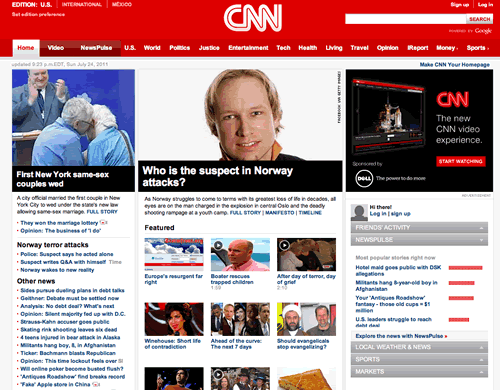
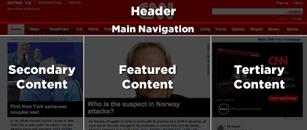

# 布局规则

CSS，本质上来说是用来在页面中布局元素的。但是页面当中主次组件的布局是有区别的。例如插图，登录表单，或者是导航栏，这些是次要组件，一般放置在主要组件（头部，尾部等）之中。我将次要组件称为模块，这将会在下一篇文章中介绍。而主要组件我称之为布局（Layout）。

基于可重用性，布局样式同样可以分为主要样式和次要样式。像header和footer这样的主要样式，通常会使用ID选择器，但是我们也需要思考组件在页面中通用性，如果具有通用性，那就应使用类选择器。

```css
/* 布局声明 */

#header, #article, #footer {
    width: 960px;
    margin: auto;
}

#article {
    border: solid #CCC;
    border-width: 1px 0 0;
}
```

一些网站可能需要使用比较流行的布局框架，例如[960.gs](https://960.gs/)。这些次要布局样式将会使用类名而不是ID，这样样式就可以在同一个页面当中使用多次了。

通常，一个布局样式只有一个选择器：单个ID或者类名。但是，有时候针对不同的情况，可能需要不同的布局样式。例如，你可能想根据用户的偏好有不同的布局。这种布局上的偏好也会被定义为布局样式，而且会与其他布局样式一起使用。

```css
/* 使用更高阶的布局样式影响其他布局样式 */
#article {
    float: left;
}

#sidebar {
    float: right;
}

.l-flipped #article {
    float: right;
}

.l-flipped #sidebar {
    float: left;
}
```

在这个布局例子中，`.l-flipped`类名被应用于更高层次的元素中，例如body元素，并且使得article和sidebar部分的布局能够交换，sidebar部分从右边交换到左边，而article则相反。

```css
/* 同时使用两个布局样式实现从流式布局到固定布局的切换 */

#article {
    width: 80%;
    float: left;
}

#sidebar {
    width: 20%;
    float: right;
}

.l-fixed #article {
    width: 600px;
}

.l-fixed #sidebar {
    width: 200px;
}
```

最后这个例子，`.l-fixed`类修改了设计好的布局，将其从流式布局（使用百分比）改成固定布局（使用像素）。

另外在这个布局例子中需要注意我使用的命名规范。使用ID选择器的声明，命名准确且没有命名空间。而类选择器却使用了`l-`前缀。这使得我们很容易就知道这些样式所代表的含义，并将它从模块和状态规则中区分出来。如果使用我的命名规范，布局样式是唯一使用ID选择器的类别。而且你也可以对你的ID选择器进行空间命名，虽然这并没什么必要。

## 使用ID选择器

需要明确的是，在HTML中使用ID属性有时可能是件好事儿，而且在某些情况下是必要的，例如，给JavaScript提供一个有用的钩子。但是对于CSS来说，ID选择器和类选择器之间的性能差距几乎是不存在，而且可能因为不断出现的变体使得样式变得更加复杂。

## 布局例子

理论是一回事儿，但应用却是另一回事儿。让我们来以一个真实的网站为例子，思考哪部分是布局，哪部分是模块。



我们来看CNN的网站，这里面有很多其他网站出现过的一些模式。例如，这里有一个头部，一个导航条，一个内容区域以及一个尾部（截屏中看不到）。



在写这篇文章的时候，网站对上述内容划分得很清楚，并为这些主要部分设置了ID属性

```css
/* 我们的CSS架构可能像下面这样 */
#header { … }
#primarynav { … }
#maincontent { … }

<div id="header"></div>
<div id="primarynav"></div>
<div id="maincontent"></div>
```

上述架构直接了当，我知道你肯定在想：“真的吗？你在向我展示怎么做到这样？！”。别着急，让我们来看页面的另一个部分。


这是`Featured`部分，我们看到了有一个个新闻的网格。CNN目前是这样标记的，一个`div`容器以及一系列孩子`div`。如果是我，我可能偏向于用无序列表来布局，所以我们来重新标记。

```html
<!-- Featured部分的HTML代码 -->
<div>
<h2>Featured</h2>
<ul>
    <li><a href="…">…</a></li>
    <li><a href="…">…</a></li>
    …
</ul>
</div>
```

不去想SMACSS方法，我们可能倾向于给容器 `div`添加`featured`ID，然后为div中的内容写样式。

```css
/* featured列表的可能样式 */
div#featured ul { 
    margin: 0;
    padding: 0;
    list-style-type: none;
}

div#featured li {
    float: left;
    height: 100px;
    margin-left: 10px;
}
```

在编写上述样式的时候，我们可能已经有一些预设：

1. 这个页面上只会有一个`featured`部分
2. 列表项都浮动到左侧
3. 列表项都是100px的高度

对于小型网站来说，这可能是一个很好的例子。因为小型网站，不太可能更改，也不太可能变得比现在更复杂。不过，具有较高变化率的较大站点，很可能会因重构页面中一个组件而修改与之相关的样式。

我们重新看下代码，肯定有一些地方是需要优化的。首先，ID选择器不需要标签选择器进行限定，并且由于网格是`div`容器的直接子节点，所以应该用孩子选择器（`>`）。

让我们来看一下如何修改才能更灵活一些。

从布局的角度来说，我们所关心的是网格之间的关联关系。我们不一定关心模块本身的设计也不担心布局所处的环境。

```css
/* 网格模块应用于OL或UL */

.l-grid {
    margin: 0;
    padding: 0;
    list-style-type: none;
}

.l-grid > li {
    display: inline-block;
    margin: 0 0 10px 10px; 

    /* IE7 hack to mimic inline-block on block elements */
    *display: inline;
    *zoom: 1;
}
```

那么用这种方法我们解决了什么问题呢？

1. 现在网格布局可以应用于任何容器进行浮动式布局。
2. 我们将适用性深度（具体看`适用性深度`这个章节）降低了1
3. 我们降低了选择器的特殊性
4. 高度要求被去掉了。行的高度将取决于高度最高的行内项。

另一方面，我们引发了什么问题呢？（没有任何一种解决方案能100%解决问题的）

1. 通过使用孩子选择器，我们无法兼容IE6（我们可以通过不使用孩子选择器来避免这一点）
2. CSS体积更大，内容更复杂了

表面上，CSS的体积确实增大了，但是其实我们有了一个可重用的模块，我们可以将其应用于整个网站而没有重复代码。所以复杂性的增加也只是表面上的。不过，我们现在确实得为一些过时的浏览器编码，并且还可能还要使用一些奇葩的hack手段。但是选择器却更加简单了，而且我们可以对这个布局样式进行扩展，使得布局能够适用于更加特殊的布局。

